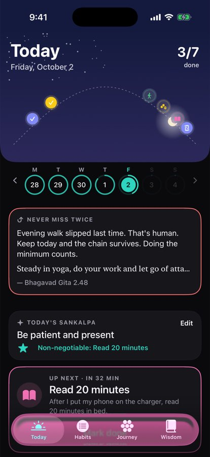
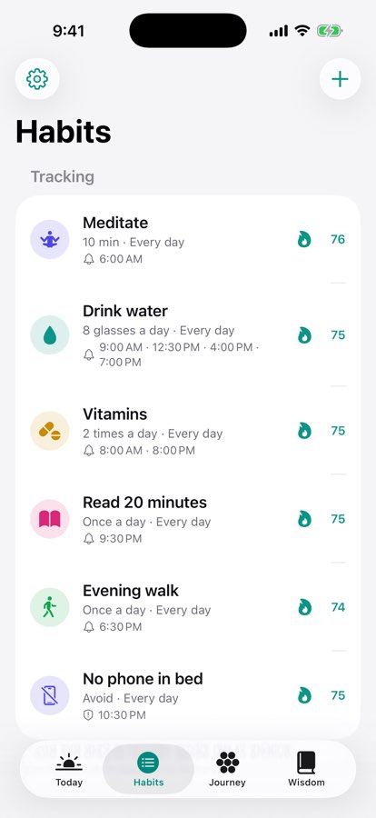
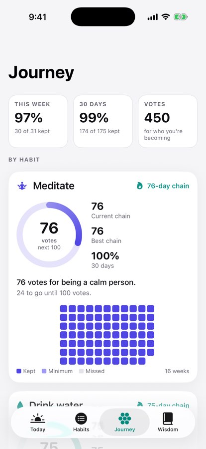
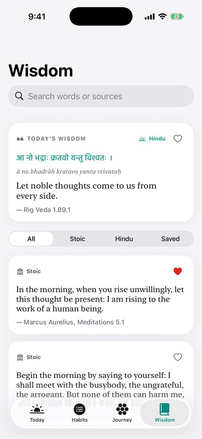

# Hexis

A native iPhone habit tracker built with SwiftUI.

**The name.** *Hexis* (ἕξις) is the Greek word Epictetus uses for a habit, a settled way of being: "Every *hexis* and faculty is maintained and increased by the corresponding actions" (Discourses 2.18). The icon is a ring of seven segments, one for each day of the week, around a check.

**How it works.**
- Each habit is a ring that fills as you make progress and turns into a check when you're done.
- Habits sit on a sky that follows the time of day.
- Reminders arrive at each habit's preferred time.
- Stoic and Hindu wisdom shows up at the moments it helps most.

## Screens

| Today | Habits | Journey | Wisdom |
| --- | --- | --- | --- |
|  |  |  |  |

These are simulator captures with sample data. The Screenshots workflow regenerates them when you run it from the Actions tab.

## What's inside

**Habits**
- Four kinds: **yes / no**, **count** (8 glasses of water), **timed** (meditate 10 minutes, with a breathing guide and a Lock Screen countdown) and **quit** (no sugar; each day counts unless you log a slip).
- **Several times a day.** "Vitamins at 8 am and 8 pm" is two check-ins, each with its own reminder.
- **Days of the week** for each habit. Days a habit isn't scheduled never break its streak.

**Reminders**
- A notification at each preferred time, with **Done**, **+1**, **Start timer** or **Snooze 15 min** buttons.
- One gentle follow-up if a habit is still open. It offers **Did the minimum**.
- Reminders for things you've already done are cancelled. Quit habits get one nudge at your "risky time".

**The psychology built in**
- **When-then plans.** "After I make coffee, I will read on the balcony." The editor builds the sentence, and reminders use it.
- **Never miss twice.** One missed day is forgiven; two in a row break the chain. After a miss, the app says so kindly and shows a recovery quote.
- **A minimum for hard days.** Every habit can have a tiny version that still keeps the chain.
- **Votes and milestones.** Each kept day is a vote for who you're becoming ("212 votes for being a reader"). Milestones at 7, 21, 30, 66 and 100 votes; 66 days is the average time for a habit to feel automatic (Lally et al., 2010).
- **Fresh starts.** Mondays, the 1st of the month and your birthday get a fresh-start card.
- **Morning Sankalpa:** one intention, plus one habit that can't slip.
- **Evening review:** Seneca's three questions (On Anger 3.36).
- **Timing insights.** If you always read at 9:40 pm instead of 9:00, Journey offers to move the reminder.

**Wisdom**
- 124 sourced quotes: Marcus Aurelius, Epictetus, Seneca, Musonius Rufus, Zeno, the Bhagavad Gita, the Upanishads, the Vedas, the Yoga Sutras, Vivekananda, Kabir, Bhartṛhari and more.
- Sanskrit and Hindi originals with transliteration.
- Quotes are matched to moments: morning, after a miss, a long streak, an urge, the timer, a completed day.

**Widgets**
- Home screen **Up next** (small) and **Today** (medium). Both have buttons that mark a habit done without opening the app.
- Lock Screen widgets.
- A Live Activity for timed habits.

**Your data**
- Everything stays on your iPhone in one file.
- Settings → Backup saves it to Files or iCloud Drive, and restores it later.
- You can also import a backup from the Habit Chain web tracker.

## Put it on your iPhone

You need a Mac, a USB cable for your iPhone, and an Apple ID.

1. **Install Xcode 27 or newer** from the Mac App Store. It's free. Your iPhone runs iOS 27, and Xcode can only install apps on iOS versions it knows about, so an older Xcode won't see your phone as a place to run the app.
2. **Get the code.** Either:
   - On GitHub, switch to the branch `claude/iphone-habit-tracker-vx0avy`, then choose **Code → Download ZIP**, or
   - Run `git clone -b claude/iphone-habit-tracker-vx0avy https://github.com/aniketsompura/Habit_Tracker.git`
3. **Open the project.** Double-click `ios/Hexis.xcodeproj`.
4. **Add your Apple ID.** Xcode → Settings → Accounts → **+** → Apple ID.
5. **Set signing.** Click **Hexis** at the top of the left sidebar. For each target, **Hexis** and **HexisWidgets**:
   - Open **Signing & Capabilities**.
   - Set **Team** to your name (Personal Team).
6. **Prepare your iPhone.**
   - Connect it with the cable and tap **Trust** on the phone.
   - Turn on Settings → Privacy & Security → **Developer Mode** (the phone restarts).
7. **Run it.** Choose your iPhone at the top of the Xcode window and press **Run** (⌘R).
8. **Trust yourself as a developer.** The first time, iPhone may say "Untrusted Developer". Go to Settings → General → VPN & Device Management, tap your Apple ID, then **Trust**.
9. **Allow reminders** when Hexis asks.
10. **Add widgets.**
    - Home screen: long-press the home screen → **Edit → Add Widget → Hexis**.
    - Lock Screen: long-press the Lock Screen → **Customize**.

### With a free Apple ID

Hexis is built to work with a free Apple ID: reminders with their buttons, the timer and its Lock Screen countdown all use features free accounts have. Widgets need an App Group to share data with the app. If Xcode refuses it for your account, see "If something goes wrong" below: the app still works fully, and only the widgets wait. A few limits come with free signing:

- **Re-install every 7 days.** The app stops opening after 7 days. Plug in your iPhone, open the project, and press Run again. It takes about a minute, and your habits and history stay as long as you don't delete the app.
- **Back up now and then.** Settings → Backup → Save a backup. If you ever delete the app, restore from that file.
- **Three apps at a time.** A free account can have up to 3 of your own apps installed at once.
- **If you join the paid Apple Developer Program later** ($99 a year), the app lasts a year between installs. Nothing else changes.

### If something goes wrong

- **"Failed to register bundle identifier" or "No profiles for…"**
  - The app's ID is already taken.
  - Click the **Hexis** project, open **Build Settings**, search for `HEXIS_ID_PREFIX`, and change `com.aniketsompura` to something unique, like `com.yourname.habits`.
- **"Personal development teams do not support App Groups"**
  - Remove **App Groups** from both targets under Signing & Capabilities.
  - The app works normally. The widgets show "turn on widgets" until you use a paid account and add the App Group back.
- **No reminders.** Check Settings → Notifications → Hexis. In the app, Habits → gear → Reminders shows the status.
- **No Lock Screen timer.** Turn on Settings → Hexis → Live Activities.

## Code layout

| Folder | What it holds |
| --- | --- |
| `Core/` | Plain Swift logic shared by the app and widgets: models, streaks, agenda, reminder planning, quotes (`Resources/quotes.json`), backup, templates. |
| `CoreTests/` | Unit tests for `Core`. Run with `swift test --package-path ios`. |
| `Shared/` | SwiftUI and system code used by both the app and widgets: theme, sky, the habit ring, data file, notifications, App Intents, the timer Live Activity. |
| `Hexis/` | The app: Today, Habits, Journey, Wisdom, Settings, rituals, timer, onboarding. |
| `HexisWidgets/` | Home screen and Lock Screen widgets and the Live Activity. |
| `Config/` | Info.plists and entitlements. |

The Xcode project uses synchronized folders, so new Swift files in these folders are picked up automatically. Every push builds the app and runs the tests on GitHub's macOS runners (`.github/workflows/ios.yml`).

Minimum iOS version: 17. Built and tested with Xcode 26.6 on GitHub; on iOS 26 and later the app picks up the system's Liquid Glass look.
